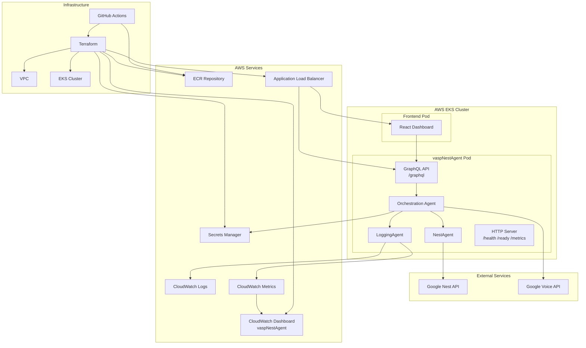
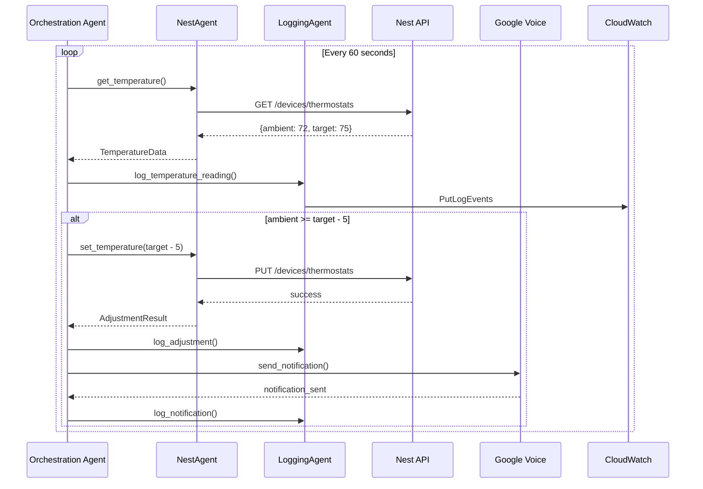
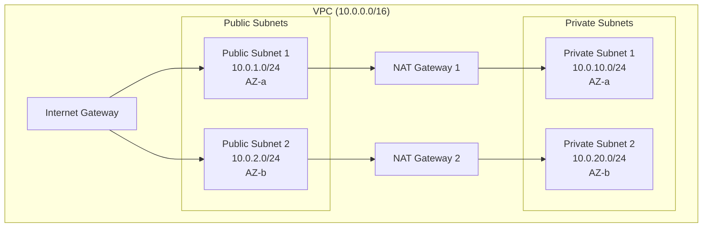
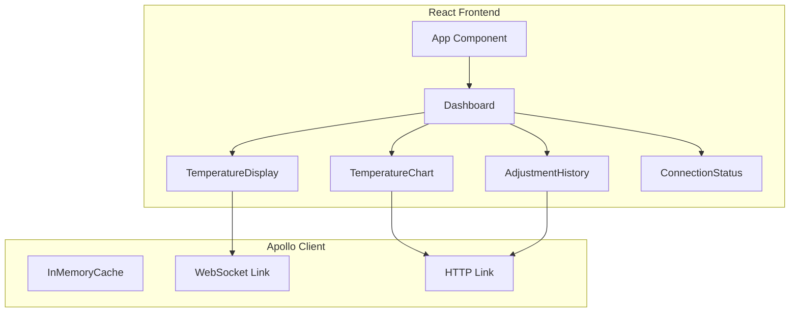

# Design Document: vaspNestAgent

## Overview

vaspNestAgent is a Python-based thermostat monitoring and control system that uses the Strands SDK for multi-agent orchestration. The system continuously monitors a Google Nest thermostat, automatically adjusts temperature settings based on ambient conditions, and sends notifications via Google Voice. It includes a React-based frontend dashboard with real-time GraphQL subscriptions for live temperature monitoring. The entire system is deployed as containerized applications on AWS EKS with full infrastructure-as-code management using Terraform.

The architecture follows a multi-agent pattern with three primary agents:
- **Orchestration Agent**: Main coordinator that manages the monitoring loop and decision logic
- **NestAgent**: Specialized agent for Google Nest API interactions
- **LoggingAgent**: Specialized agent for CloudWatch logging and metrics

Additionally, the system includes:
- **GraphQL API**: Real-time data access layer with WebSocket subscriptions
- **React Frontend**: Real-time dashboard for temperature monitoring

## Architecture



### Component Interaction Flow



## Components and Interfaces

### 1. Orchestration Agent

The main coordinator that implements the monitoring loop and decision logic.

```python
class OrchestrationAgent:
    """Main agent coordinating NestAgent and LoggingAgent."""
    
    def __init__(self, config: Config):
        self.config = config
        self.nest_agent = NestAgent(config)
        self.logging_agent = LoggingAgent(config)
        self.last_adjustment_time: Optional[datetime] = None
        self.running = False
    
    async def start(self) -> None:
        """Start the monitoring loop."""
        
    async def stop(self) -> None:
        """Graceful shutdown."""
        
    async def monitor_cycle(self) -> None:
        """Execute one monitoring cycle."""
        
    def should_adjust_temperature(
        self, ambient: float, target: float
    ) -> bool:
        """Determine if temperature adjustment is needed."""
        
    async def send_notification(
        self, previous: float, new: float, ambient: float
    ) -> bool:
        """Send Google Voice notification."""
```

### 2. NestAgent

Specialized agent for Google Nest API interactions using Strands tools.

```python
class NestAgent:
    """Agent for Nest thermostat API interactions."""
    
    def __init__(self, config: Config):
        self.config = config
        self.oauth_token: Optional[str] = None
        self.token_expiry: Optional[datetime] = None
    
    @tool
    async def get_temperature(self) -> TemperatureData:
        """Get current ambient and target temperature."""
        
    @tool
    async def set_temperature(self, target: float) -> AdjustmentResult:
        """Set new target temperature."""
        
    async def authenticate(self) -> None:
        """Authenticate with Google Nest API using OAuth2."""
        
    async def refresh_token(self) -> None:
        """Refresh OAuth2 token if expired."""
```

### 3. LoggingAgent

Specialized agent for CloudWatch logging and metrics.

```python
class LoggingAgent:
    """Agent for CloudWatch logging and metrics."""
    
    def __init__(self, config: Config):
        self.config = config
        self.logs_client = boto3.client('logs')
        self.metrics_client = boto3.client('cloudwatch')
        self.log_group = config.cloudwatch_log_group
    
    @tool
    async def log_temperature_reading(
        self, data: TemperatureData
    ) -> None:
        """Log temperature reading to CloudWatch."""
        
    @tool
    async def log_adjustment(
        self, adjustment: AdjustmentEvent
    ) -> None:
        """Log temperature adjustment event."""
        
    @tool
    async def log_notification(
        self, notification: NotificationEvent
    ) -> None:
        """Log notification event."""
        
    async def publish_metric(
        self, metric_name: str, value: float, unit: str
    ) -> None:
        """Publish custom metric to CloudWatch."""
```

### 4. HTTP Server

Exposes health, readiness, and metrics endpoints.

```python
class HealthServer:
    """HTTP server for health and metrics endpoints."""
    
    def __init__(self, agent: OrchestrationAgent, port: int = 8080):
        self.agent = agent
        self.port = port
        self.app = FastAPI()
    
    async def health_check(self) -> HealthResponse:
        """GET /health - Returns 200 if healthy, 503 if degraded."""
        
    async def readiness_check(self) -> ReadinessResponse:
        """GET /ready - Returns 200 if ready to process."""
        
    async def metrics(self) -> str:
        """GET /metrics - Returns Prometheus-compatible metrics."""
```

### 5. GraphQL API Server

Real-time data access layer with WebSocket subscriptions for the frontend.

```python
from ariadne import QueryType, SubscriptionType, make_executable_schema
from ariadne.asgi import GraphQL
import asyncio

query = QueryType()
subscription = SubscriptionType()

@query.field("currentTemperature")
async def resolve_current_temperature(_, info) -> dict:
    """Get current temperature reading."""
    return await info.context["agent"].get_latest_temperature()

@query.field("temperatureHistory")
async def resolve_temperature_history(_, info, hours: int = 24) -> list:
    """Get temperature history for the specified hours."""
    return await info.context["agent"].get_temperature_history(hours)

@query.field("adjustmentHistory")
async def resolve_adjustment_history(_, info, limit: int = 10) -> list:
    """Get recent adjustment events."""
    return await info.context["agent"].get_adjustment_history(limit)

@subscription.source("temperatureUpdates")
async def temperature_updates_source(_, info):
    """Subscribe to real-time temperature updates."""
    while True:
        yield await info.context["agent"].get_latest_temperature()
        await asyncio.sleep(2)

@subscription.field("temperatureUpdates")
def temperature_updates_resolver(temperature, info):
    return temperature

type_defs = """
    type Query {
        currentTemperature: TemperatureReading!
        temperatureHistory(hours: Int = 24): [TemperatureReading!]!
        adjustmentHistory(limit: Int = 10): [AdjustmentEvent!]!
        temperatureTimeline(hours: Int = 24): TemperatureTimeline!
    }
    
    type Subscription {
        temperatureUpdates: TemperatureReading!
        adjustmentEvents: AdjustmentEvent!
    }
    
    type TemperatureReading {
        ambientTemperature: Float!
        targetTemperature: Float!
        thermostatId: String!
        timestamp: String!
        humidity: Float
        hvacMode: String
    }
    
    type AdjustmentEvent {
        id: ID!
        previousSetting: Float!
        newSetting: Float!
        ambientTemperature: Float!
        triggerReason: String!
        timestamp: String!
        notificationSent: Boolean!
    }
    
    type TemperatureTimeline {
        readings: [TemperatureReading!]!
        adjustments: [AdjustmentEvent!]!
        startTime: String!
        endTime: String!
    }
"""

schema = make_executable_schema(type_defs, query, subscription)
graphql_app = GraphQL(schema, debug=True)
```

### 6. Configuration Manager

Handles configuration from environment variables and AWS Secrets Manager.

```python
@dataclass
class Config:
    """Application configuration."""
    
    # Non-sensitive (from environment)
    polling_interval: int = 60
    cooldown_period: int = 1800  # 30 minutes
    temperature_threshold: float = 5.0
    temperature_adjustment: float = 5.0
    cloudwatch_log_group: str = "/vaspNestAgent/logs"
    aws_region: str = "us-east-1"
    
    # Sensitive (from Secrets Manager)
    nest_client_id: str = ""
    nest_client_secret: str = ""
    nest_refresh_token: str = ""
    google_voice_credentials: str = ""
    google_voice_phone_number: str = ""
    
    @classmethod
    async def load(cls) -> "Config":
        """Load configuration from environment and Secrets Manager."""
        
    def validate(self) -> None:
        """Validate all configuration values."""
```

## Data Models

```python
from dataclasses import dataclass
from datetime import datetime
from enum import Enum
from typing import Optional

class EventType(Enum):
    TEMPERATURE_READING = "temperature_reading"
    TEMPERATURE_ADJUSTMENT = "temperature_adjustment"
    NOTIFICATION_SENT = "notification_sent"
    NOTIFICATION_FAILED = "notification_failed"
    API_ERROR = "api_error"
    AGENT_STARTED = "agent_started"
    AGENT_STOPPED = "agent_stopped"

class Severity(Enum):
    INFO = "INFO"
    WARNING = "WARNING"
    ERROR = "ERROR"

@dataclass
class TemperatureData:
    """Temperature reading from Nest thermostat."""
    ambient_temperature: float  # Fahrenheit
    target_temperature: float   # Fahrenheit
    thermostat_id: str
    timestamp: datetime
    humidity: Optional[float] = None
    hvac_mode: Optional[str] = None

@dataclass
class AdjustmentResult:
    """Result of temperature adjustment operation."""
    success: bool
    previous_target: float
    new_target: float
    timestamp: datetime
    error_message: Optional[str] = None

@dataclass
class AdjustmentEvent:
    """Event logged when temperature is adjusted."""
    event_type: EventType = EventType.TEMPERATURE_ADJUSTMENT
    previous_setting: float
    new_setting: float
    ambient_temperature: float
    trigger_reason: str
    timestamp: datetime
    thermostat_id: str

@dataclass
class NotificationEvent:
    """Event logged when notification is sent."""
    event_type: EventType
    phone_number: str  # Masked for logging
    message_summary: str
    success: bool
    timestamp: datetime
    error_message: Optional[str] = None

@dataclass
class LogEvent:
    """Structured log event for CloudWatch."""
    timestamp: datetime
    event_type: EventType
    severity: Severity
    data: dict
    
    def to_json(self) -> str:
        """Serialize to JSON for CloudWatch."""

@dataclass
class HealthResponse:
    """Health check response."""
    status: str  # "healthy" or "degraded"
    nest_api_connected: bool
    last_temperature_reading: Optional[datetime]
    uptime_seconds: float

@dataclass
class ReadinessResponse:
    """Readiness check response."""
    ready: bool
    config_loaded: bool
    agents_initialized: bool
```


## Correctness Properties

*A property is a characteristic or behavior that should hold true across all valid executions of a system-essentially, a formal statement about what the system should do. Properties serve as the bridge between human-readable specifications and machine-verifiable correctness guarantees.*

Based on the prework analysis, the following correctness properties have been identified. Redundant properties have been consolidated where one property subsumes another.

### Property 1: Temperature Adjustment Logic
*For any* ambient temperature and target temperature pair where (target - ambient) < 5°F, the system SHALL compute a new target of (target - 5)°F. *For any* pair where (target - ambient) >= 5°F, no adjustment SHALL be made.

**Validates: Requirements 2.1**

### Property 2: Cooldown Period Enforcement
*For any* sequence of temperature readings within the cooldown period after an adjustment, the system SHALL NOT make additional adjustments regardless of temperature differential.

**Validates: Requirements 2.5**

### Property 3: Retry Limit Compliance
*For any* sequence of API failures (Nest API or Google Voice), the retry count SHALL NOT exceed the configured maximum (5 for connection, 3 for adjustments, 3 for notifications).

**Validates: Requirements 1.4, 2.3, 3.3**

### Property 4: Notification Content Completeness
*For any* notification sent after a temperature adjustment, the message SHALL contain the previous temperature, new temperature, and current ambient temperature.

**Validates: Requirements 3.2**

### Property 5: Rate Limiting Enforcement
*For any* sequence of temperature adjustments within a one-hour window, at most one notification SHALL be sent when rate limiting is enabled.

**Validates: Requirements 3.5**

### Property 6: Configuration Validation
*For any* configuration value outside its expected format or range, the validation function SHALL reject it and return an appropriate error.

**Validates: Requirements 5.3, 5.4**

### Property 7: Log Event Completeness
*For any* temperature reading, adjustment, or notification event, the corresponding log entry SHALL contain a timestamp and all required event-specific fields.

**Validates: Requirements 1.5, 2.4, 3.4, 5.5**

### Property 8: Metrics Consistency
*For any* operation (temperature reading, adjustment, notification, API call), the corresponding metric counter SHALL be incremented exactly once.

**Validates: Requirements 6.4**

### Property 9: Error Recovery
*For any* unhandled exception during the monitoring loop, the agent SHALL log the error and continue operation without terminating.

**Validates: Requirements 7.1**

### Property 10: Duplicate Adjustment Prevention
*For any* restart scenario, the system SHALL NOT make duplicate adjustments for the same temperature condition that was already adjusted before restart.

**Validates: Requirements 7.3**

### Property 11: Error Threshold Alerting
*For any* error count exceeding the configured threshold, exactly one alert notification SHALL be sent to the configured phone number.

**Validates: Requirements 7.5**

### Property 12: Temperature Data Parsing Round-Trip
*For any* valid Nest API response, parsing the response and serializing the resulting TemperatureData back to JSON SHALL produce equivalent temperature values.

**Validates: Requirements 1.3**

### Property 13: GraphQL Subscription Latency
*For any* temperature update event, the GraphQL subscription SHALL deliver the update to connected clients within 2 seconds of the data being available.

**Validates: Requirements 15.2**

### Property 14: GraphQL Response Completeness
*For any* GraphQL query for temperature data, the response SHALL contain all required fields (ambientTemperature, targetTemperature, thermostatId, timestamp).

**Validates: Requirements 15.1, 17.3**

## Error Handling

### Error Categories

| Category | Examples | Handling Strategy |
|----------|----------|-------------------|
| Authentication | OAuth token expired, invalid credentials | Refresh token, retry with backoff |
| Network | Connection timeout, DNS failure | Exponential backoff, max 5 retries |
| API | Rate limiting, invalid request | Log error, retry with backoff |
| Configuration | Missing required value, invalid format | Fail startup with descriptive error |
| Runtime | Unhandled exception | Log error, continue operation |

### Exponential Backoff Strategy

```python
def calculate_backoff(attempt: int, base_delay: float = 1.0, max_delay: float = 60.0) -> float:
    """Calculate exponential backoff delay with jitter."""
    delay = min(base_delay * (2 ** attempt), max_delay)
    jitter = random.uniform(0, delay * 0.1)
    return delay + jitter
```

### Graceful Shutdown

```python
async def graceful_shutdown(self, signal: signal.Signals) -> None:
    """Handle shutdown signals gracefully."""
    logger.info(f"Received {signal.name}, initiating graceful shutdown")
    self.running = False
    
    # Wait for current cycle to complete (max 30 seconds)
    await asyncio.wait_for(self.current_cycle, timeout=30.0)
    
    # Flush pending logs
    await self.logging_agent.flush()
    
    # Close connections
    await self.nest_agent.close()
    
    logger.info("Graceful shutdown complete")
```

## Testing Strategy

### Property-Based Testing Framework

The project will use **Hypothesis** for Python property-based testing. Hypothesis is the standard PBT library for Python and integrates well with pytest.

### Test Configuration

```python
# conftest.py
from hypothesis import settings, Verbosity

settings.register_profile("ci", max_examples=100, deadline=None)
settings.register_profile("dev", max_examples=10, deadline=None)
settings.load_profile("ci")
```

### Property-Based Tests

Each correctness property will be implemented as a Hypothesis property test:

```python
from hypothesis import given, strategies as st

# Property 1: Temperature Adjustment Logic
@given(
    ambient=st.floats(min_value=-50, max_value=120),
    target=st.floats(min_value=50, max_value=90)
)
def test_temperature_adjustment_logic(ambient: float, target: float):
    """
    **Feature: nest-thermostat-agent, Property 1: Temperature Adjustment Logic**
    **Validates: Requirements 2.1**
    """
    result = should_adjust_temperature(ambient, target)
    new_target = calculate_new_target(ambient, target)
    
    if target - ambient < 5:
        assert result is True
        assert new_target == target - 5
    else:
        assert result is False
        assert new_target == target
```

### Unit Tests

Unit tests will cover specific examples and edge cases:

- OAuth authentication flow
- Health/readiness endpoint responses
- Graceful shutdown behavior
- Configuration loading from environment and Secrets Manager

### Test Organization

```
tests/
├── conftest.py                    # Shared fixtures and Hypothesis settings
├── unit/
│   ├── test_config.py             # Configuration loading tests
│   ├── test_health_server.py      # HTTP endpoint tests
│   └── test_agents.py             # Agent initialization tests
├── property/
│   ├── test_temperature_logic.py  # Properties 1, 2
│   ├── test_retry_logic.py        # Property 3
│   ├── test_notification.py       # Properties 4, 5
│   ├── test_config_validation.py  # Property 6
│   ├── test_logging.py            # Property 7
│   ├── test_metrics.py            # Property 8
│   ├── test_error_handling.py     # Properties 9, 10, 11
│   └── test_parsing.py            # Property 12
└── integration/
    └── test_agent_orchestration.py
```


## Infrastructure Design

### Terraform Module Structure

```
terraform/
├── main.tf                    # Root module
├── variables.tf               # Input variables
├── outputs.tf                 # Output values
├── backend.tf                 # S3/DynamoDB state configuration
├── providers.tf               # AWS provider configuration
├── modules/
│   ├── vpc/
│   │   ├── main.tf
│   │   ├── variables.tf
│   │   └── outputs.tf
│   ├── eks/
│   │   ├── main.tf
│   │   ├── variables.tf
│   │   └── outputs.tf
│   ├── ecr/
│   │   ├── main.tf
│   │   ├── variables.tf
│   │   └── outputs.tf
│   ├── secrets/
│   │   ├── main.tf
│   │   ├── variables.tf
│   │   └── outputs.tf
│   ├── cloudwatch/
│   │   ├── main.tf
│   │   ├── dashboard.tf
│   │   ├── variables.tf
│   │   └── outputs.tf
│   └── kubernetes/
│       ├── main.tf
│       ├── deployment.tf
│       ├── service.tf
│       ├── configmap.tf
│       ├── variables.tf
│       └── outputs.tf
└── README.md
```

### VPC Architecture



### EKS Cluster Configuration

```hcl
# modules/eks/main.tf
resource "aws_eks_cluster" "vaspnestagent" {
  name     = "vaspnestagent-cluster"
  role_arn = aws_iam_role.eks_cluster.arn
  version  = "1.28"

  vpc_config {
    subnet_ids              = var.private_subnet_ids
    endpoint_private_access = true
    endpoint_public_access  = true
  }
}

resource "aws_eks_node_group" "vaspnestagent" {
  cluster_name    = aws_eks_cluster.vaspnestagent.name
  node_group_name = "vaspnestagent-nodes"
  node_role_arn   = aws_iam_role.eks_node.arn
  subnet_ids      = var.private_subnet_ids

  scaling_config {
    desired_size = var.node_desired_size
    max_size     = var.node_max_size
    min_size     = var.node_min_size
  }

  instance_types = var.node_instance_types
}
```

### Secrets Manager Configuration

```hcl
# modules/secrets/main.tf
resource "aws_secretsmanager_secret" "nest_credentials" {
  name = "vaspnestagent/nest-credentials"
}

resource "aws_secretsmanager_secret" "google_voice" {
  name = "vaspnestagent/google-voice"
}

resource "aws_secretsmanager_secret_version" "google_voice" {
  secret_id = aws_secretsmanager_secret.google_voice.id
  secret_string = jsonencode({
    phone_number = var.google_voice_phone_number
    credentials  = var.google_voice_credentials
  })
}
```

### CloudWatch Dashboard

```hcl
# modules/cloudwatch/dashboard.tf
resource "aws_cloudwatch_dashboard" "vaspnestagent" {
  dashboard_name = "vaspNestAgent"
  dashboard_body = jsonencode({
    widgets = [
      {
        type   = "metric"
        x      = 0
        y      = 0
        width  = 12
        height = 6
        properties = {
          title  = "Temperature Readings"
          region = var.aws_region
          metrics = [
            ["vaspNestAgent", "AmbientTemperature"],
            ["vaspNestAgent", "TargetTemperature"]
          ]
        }
      },
      {
        type   = "metric"
        x      = 12
        y      = 0
        width  = 12
        height = 6
        properties = {
          title  = "Adjustment Counts"
          region = var.aws_region
          metrics = [
            ["vaspNestAgent", "AdjustmentCount", { stat = "Sum" }]
          ]
        }
      },
      {
        type   = "metric"
        x      = 0
        y      = 6
        width  = 12
        height = 6
        properties = {
          title  = "Notification Status"
          region = var.aws_region
          metrics = [
            ["vaspNestAgent", "NotificationSuccess", { stat = "Sum" }],
            ["vaspNestAgent", "NotificationFailure", { stat = "Sum" }]
          ]
        }
      },
      {
        type   = "metric"
        x      = 12
        y      = 6
        width  = 12
        height = 6
        properties = {
          title  = "API Latencies"
          region = var.aws_region
          metrics = [
            ["vaspNestAgent", "NestAPILatency", { stat = "Average" }],
            ["vaspNestAgent", "GoogleVoiceLatency", { stat = "Average" }]
          ]
        }
      },
      {
        type   = "metric"
        x      = 0
        y      = 12
        width  = 24
        height = 6
        properties = {
          title  = "Error Counts & Health"
          region = var.aws_region
          metrics = [
            ["vaspNestAgent", "ErrorCount", { stat = "Sum" }],
            ["vaspNestAgent", "HealthStatus"]
          ]
        }
      }
    ]
  })
}
```

### Kubernetes Manifests

```yaml
# modules/kubernetes/backend-deployment.yaml
apiVersion: apps/v1
kind: Deployment
metadata:
  name: vaspnestagent-backend
  namespace: default
spec:
  replicas: 1
  selector:
    matchLabels:
      app: vaspnestagent-backend
  template:
    metadata:
      labels:
        app: vaspnestagent-backend
    spec:
      serviceAccountName: vaspnestagent
      containers:
        - name: vaspnestagent
          image: ${ecr_repository_url}/backend:latest
          ports:
            - containerPort: 8080
          envFrom:
            - configMapRef:
                name: vaspnestagent-config
          livenessProbe:
            httpGet:
              path: /health
              port: 8080
            initialDelaySeconds: 10
            periodSeconds: 30
          readinessProbe:
            httpGet:
              path: /ready
              port: 8080
            initialDelaySeconds: 5
            periodSeconds: 10
          resources:
            requests:
              memory: "256Mi"
              cpu: "100m"
            limits:
              memory: "512Mi"
              cpu: "500m"
---
apiVersion: v1
kind: Service
metadata:
  name: vaspnestagent-backend
spec:
  selector:
    app: vaspnestagent-backend
  ports:
    - port: 8080
      targetPort: 8080
  type: ClusterIP
```

```yaml
# modules/kubernetes/frontend-deployment.yaml
apiVersion: apps/v1
kind: Deployment
metadata:
  name: vaspnestagent-frontend
  namespace: default
spec:
  replicas: 2
  selector:
    matchLabels:
      app: vaspnestagent-frontend
  template:
    metadata:
      labels:
        app: vaspnestagent-frontend
    spec:
      containers:
        - name: frontend
          image: ${ecr_repository_url}/frontend:latest
          ports:
            - containerPort: 80
          env:
            - name: REACT_APP_GRAPHQL_HTTP_URL
              value: "http://vaspnestagent-backend:8080/graphql"
            - name: REACT_APP_GRAPHQL_WS_URL
              value: "ws://vaspnestagent-backend:8080/graphql"
          livenessProbe:
            httpGet:
              path: /
              port: 80
            initialDelaySeconds: 5
            periodSeconds: 30
          readinessProbe:
            httpGet:
              path: /
              port: 80
            initialDelaySeconds: 3
            periodSeconds: 10
          resources:
            requests:
              memory: "64Mi"
              cpu: "50m"
            limits:
              memory: "128Mi"
              cpu: "200m"
---
apiVersion: v1
kind: Service
metadata:
  name: vaspnestagent-frontend
spec:
  selector:
    app: vaspnestagent-frontend
  ports:
    - port: 80
      targetPort: 80
  type: ClusterIP
```

```yaml
# modules/kubernetes/ingress.yaml
apiVersion: networking.k8s.io/v1
kind: Ingress
metadata:
  name: vaspnestagent-ingress
  annotations:
    kubernetes.io/ingress.class: alb
    alb.ingress.kubernetes.io/scheme: internet-facing
    alb.ingress.kubernetes.io/target-type: ip
spec:
  rules:
    - http:
        paths:
          - path: /graphql
            pathType: Prefix
            backend:
              service:
                name: vaspnestagent-backend
                port:
                  number: 8080
          - path: /health
            pathType: Prefix
            backend:
              service:
                name: vaspnestagent-backend
                port:
                  number: 8080
          - path: /metrics
            pathType: Prefix
            backend:
              service:
                name: vaspnestagent-backend
                port:
                  number: 8080
          - path: /
            pathType: Prefix
            backend:
              service:
                name: vaspnestagent-frontend
                port:
                  number: 80
```

### Docker Configuration

```dockerfile
# Dockerfile
FROM python:3.11-slim

WORKDIR /app

# Install dependencies
COPY requirements.txt .
RUN pip install --no-cache-dir -r requirements.txt

# Copy application code
COPY src/ ./src/

# Create non-root user
RUN useradd -m -u 1000 appuser
USER appuser

# Expose health check port
EXPOSE 8080

# Run the application
CMD ["python", "-m", "src.main"]
```

## Frontend Design

### React Application Architecture



### Frontend Components

```typescript
// src/components/Dashboard.tsx
import { useSubscription, useQuery } from '@apollo/client';
import { 
  TEMPERATURE_SUBSCRIPTION, 
  ADJUSTMENT_SUBSCRIPTION,
  TEMPERATURE_TIMELINE, 
  ADJUSTMENT_HISTORY 
} from '../graphql/queries';

export const Dashboard: React.FC = () => {
  // Real-time subscriptions
  const { data: currentTemp, loading: tempLoading } = useSubscription(TEMPERATURE_SUBSCRIPTION);
  const { data: latestAdjustment } = useSubscription(ADJUSTMENT_SUBSCRIPTION);
  
  // Historical data with adjustments
  const { data: timeline, refetch: refetchTimeline } = useQuery(TEMPERATURE_TIMELINE, { 
    variables: { hours: 24 },
    pollInterval: 60000 // Refresh every minute
  });
  const { data: adjustments, refetch: refetchAdjustments } = useQuery(ADJUSTMENT_HISTORY, { 
    variables: { limit: 20 } 
  });

  // Refetch when new adjustment occurs
  useEffect(() => {
    if (latestAdjustment) {
      refetchTimeline();
      refetchAdjustments();
    }
  }, [latestAdjustment, refetchTimeline, refetchAdjustments]);

  return (
    <div className="dashboard">
      <header className="dashboard-header">
        <h1>vaspNestAgent Dashboard</h1>
        <ConnectionStatus connected={!tempLoading} />
      </header>
      
      <section className="current-status">
        <TemperatureDisplay 
          ambient={currentTemp?.temperatureUpdates.ambientTemperature}
          target={currentTemp?.temperatureUpdates.targetTemperature}
          humidity={currentTemp?.temperatureUpdates.humidity}
          hvacMode={currentTemp?.temperatureUpdates.hvacMode}
        />
      </section>
      
      <section className="temperature-history">
        <TemperatureChart 
          data={timeline?.temperatureTimeline.readings} 
          adjustments={timeline?.temperatureTimeline.adjustments}
        />
      </section>
      
      <section className="adjustment-events">
        <AdjustmentHistory 
          events={adjustments?.adjustmentHistory}
          latestEvent={latestAdjustment?.adjustmentEvents}
        />
      </section>
    </div>
  );
};
```

```typescript
// src/components/TemperatureDisplay.tsx
interface TemperatureDisplayProps {
  ambient?: number;
  target?: number;
}

export const TemperatureDisplay: React.FC<TemperatureDisplayProps> = ({ ambient, target }) => {
  return (
    <div className="temperature-display">
      <div className="temp-card ambient">
        <h3>Ambient</h3>
        <span className="temp-value">{ambient?.toFixed(1) ?? '--'}°F</span>
      </div>
      <div className="temp-card target">
        <h3>Target</h3>
        <span className="temp-value">{target?.toFixed(1) ?? '--'}°F</span>
      </div>
      <div className="temp-card differential">
        <h3>Differential</h3>
        <span className="temp-value">
          {ambient && target ? (target - ambient).toFixed(1) : '--'}°F
        </span>
      </div>
    </div>
  );
};
```

```typescript
// src/components/TemperatureChart.tsx
import { 
  LineChart, Line, XAxis, YAxis, Tooltip, Legend, 
  ResponsiveContainer, ReferenceLine, ReferenceArea 
} from 'recharts';

interface AdjustmentEvent {
  id: string;
  previousSetting: number;
  newSetting: number;
  timestamp: string;
  triggerReason: string;
}

interface TemperatureChartProps {
  data?: Array<{
    timestamp: string;
    ambientTemperature: number;
    targetTemperature: number;
  }>;
  adjustments?: AdjustmentEvent[];
}

export const TemperatureChart: React.FC<TemperatureChartProps> = ({ data, adjustments }) => {
  // Merge temperature data with adjustment markers
  const chartData = data?.map(reading => {
    const adjustment = adjustments?.find(
      adj => Math.abs(new Date(adj.timestamp).getTime() - new Date(reading.timestamp).getTime()) < 60000
    );
    return {
      ...reading,
      adjustmentMarker: adjustment ? adjustment.newSetting : null,
      adjustmentReason: adjustment?.triggerReason
    };
  });

  return (
    <div className="temperature-chart">
      <h3>Temperature History with Adjustments (24h)</h3>
      <ResponsiveContainer width="100%" height={400}>
        <LineChart data={chartData}>
          <XAxis dataKey="timestamp" tickFormatter={(t) => new Date(t).toLocaleTimeString()} />
          <YAxis domain={['auto', 'auto']} label={{ value: '°F', angle: -90, position: 'insideLeft' }} />
          <Tooltip 
            content={({ active, payload }) => {
              if (active && payload?.length) {
                const data = payload[0].payload;
                return (
                  <div className="custom-tooltip">
                    <p>Time: {new Date(data.timestamp).toLocaleString()}</p>
                    <p>Ambient: {data.ambientTemperature}°F</p>
                    <p>Target: {data.targetTemperature}°F</p>
                    {data.adjustmentMarker && (
                      <p className="adjustment-info">
                        ⚡ Adjusted to {data.adjustmentMarker}°F
                        <br />Reason: {data.adjustmentReason}
                      </p>
                    )}
                  </div>
                );
              }
              return null;
            }}
          />
          <Legend />
          <Line type="monotone" dataKey="ambientTemperature" stroke="#8884d8" name="Ambient" dot={false} />
          <Line type="monotone" dataKey="targetTemperature" stroke="#82ca9d" name="Target" strokeWidth={2} />
          {/* Adjustment event markers */}
          {adjustments?.map(adj => (
            <ReferenceLine 
              key={adj.id}
              x={adj.timestamp} 
              stroke="#ff7300" 
              strokeDasharray="5 5"
              label={{ value: '⚡', position: 'top' }}
            />
          ))}
        </LineChart>
      </ResponsiveContainer>
      
      {/* Adjustment Events Legend */}
      <div className="adjustment-legend">
        <span className="legend-item">
          <span className="marker">⚡</span> Temperature Adjustment Event
        </span>
      </div>
    </div>
  );
};
```

```typescript
// src/graphql/queries.ts
import { gql } from '@apollo/client';

export const TEMPERATURE_SUBSCRIPTION = gql`
  subscription TemperatureUpdates {
    temperatureUpdates {
      ambientTemperature
      targetTemperature
      thermostatId
      timestamp
      humidity
      hvacMode
    }
  }
`;

export const ADJUSTMENT_SUBSCRIPTION = gql`
  subscription AdjustmentEvents {
    adjustmentEvents {
      id
      previousSetting
      newSetting
      ambientTemperature
      triggerReason
      timestamp
      notificationSent
    }
  }
`;

export const TEMPERATURE_TIMELINE = gql`
  query TemperatureTimeline($hours: Int) {
    temperatureTimeline(hours: $hours) {
      readings {
        ambientTemperature
        targetTemperature
        timestamp
      }
      adjustments {
        id
        previousSetting
        newSetting
        ambientTemperature
        triggerReason
        timestamp
        notificationSent
      }
      startTime
      endTime
    }
  }
`;

export const TEMPERATURE_HISTORY = gql`
  query TemperatureHistory($hours: Int) {
    temperatureHistory(hours: $hours) {
      ambientTemperature
      targetTemperature
      timestamp
    }
  }
`;

export const ADJUSTMENT_HISTORY = gql`
  query AdjustmentHistory($limit: Int) {
    adjustmentHistory(limit: $limit) {
      id
      previousSetting
      newSetting
      ambientTemperature
      triggerReason
      timestamp
      notificationSent
    }
  }
`;
```

```typescript
// src/components/AdjustmentHistory.tsx
interface AdjustmentEvent {
  id: string;
  previousSetting: number;
  newSetting: number;
  ambientTemperature: number;
  triggerReason: string;
  timestamp: string;
  notificationSent: boolean;
}

interface AdjustmentHistoryProps {
  events?: AdjustmentEvent[];
  latestEvent?: AdjustmentEvent;
}

export const AdjustmentHistory: React.FC<AdjustmentHistoryProps> = ({ events, latestEvent }) => {
  const formatTime = (timestamp: string) => {
    const date = new Date(timestamp);
    return date.toLocaleString();
  };

  return (
    <div className="adjustment-history">
      <h3>Temperature Adjustment History</h3>
      
      {latestEvent && (
        <div className="latest-adjustment highlight">
          <span className="badge new">NEW</span>
          <div className="adjustment-details">
            <span className="time">{formatTime(latestEvent.timestamp)}</span>
            <span className="change">
              {latestEvent.previousSetting}°F → {latestEvent.newSetting}°F
            </span>
            <span className="reason">{latestEvent.triggerReason}</span>
            {latestEvent.notificationSent && <span className="notification">📱 Notified</span>}
          </div>
        </div>
      )}
      
      <table className="adjustment-table">
        <thead>
          <tr>
            <th>Time</th>
            <th>Previous</th>
            <th>New</th>
            <th>Ambient</th>
            <th>Reason</th>
            <th>Notified</th>
          </tr>
        </thead>
        <tbody>
          {events?.map(event => (
            <tr key={event.id} className={event.id === latestEvent?.id ? 'highlight' : ''}>
              <td>{formatTime(event.timestamp)}</td>
              <td>{event.previousSetting}°F</td>
              <td>{event.newSetting}°F</td>
              <td>{event.ambientTemperature}°F</td>
              <td>{event.triggerReason}</td>
              <td>{event.notificationSent ? '✅' : '—'}</td>
            </tr>
          ))}
        </tbody>
      </table>
      
      {(!events || events.length === 0) && (
        <p className="no-events">No temperature adjustments recorded yet.</p>
      )}
    </div>
  );
};
```

### Apollo Client Configuration

```typescript
// src/apollo/client.ts
import { ApolloClient, InMemoryCache, split, HttpLink } from '@apollo/client';
import { GraphQLWsLink } from '@apollo/client/link/subscriptions';
import { createClient } from 'graphql-ws';
import { getMainDefinition } from '@apollo/client/utilities';

const httpLink = new HttpLink({
  uri: process.env.REACT_APP_GRAPHQL_HTTP_URL || '/graphql',
});

const wsLink = new GraphQLWsLink(
  createClient({
    url: process.env.REACT_APP_GRAPHQL_WS_URL || 'ws://localhost:8080/graphql',
  })
);

const splitLink = split(
  ({ query }) => {
    const definition = getMainDefinition(query);
    return (
      definition.kind === 'OperationDefinition' &&
      definition.operation === 'subscription'
    );
  },
  wsLink,
  httpLink
);

export const apolloClient = new ApolloClient({
  link: splitLink,
  cache: new InMemoryCache(),
});
```

### Frontend Dockerfile

```dockerfile
# frontend/Dockerfile
FROM node:20-alpine AS builder

WORKDIR /app
COPY package*.json ./
RUN npm ci
COPY . .
RUN npm run build

FROM nginx:alpine
COPY --from=builder /app/build /usr/share/nginx/html
COPY nginx.conf /etc/nginx/conf.d/default.conf
EXPOSE 80
CMD ["nginx", "-g", "daemon off;"]
```

## Project Structure

```
vaspNestAgent/
├── .github/
│   └── workflows/
│       ├── ci.yml              # Lint, test, build (backend + frontend)
│       └── deploy.yml          # Terraform plan/apply
├── .gitignore
├── README.md
├── pyproject.toml
├── requirements.txt
├── Dockerfile                  # Backend container
├── src/                        # Python backend
│   ├── __init__.py
│   ├── main.py                 # Entry point
│   ├── config.py               # Configuration management
│   ├── agents/
│   │   ├── __init__.py
│   │   ├── orchestration.py    # Orchestration Agent
│   │   ├── nest.py             # NestAgent
│   │   └── logging.py          # LoggingAgent
│   ├── models/
│   │   ├── __init__.py
│   │   └── data.py             # Data models
│   ├── services/
│   │   ├── __init__.py
│   │   ├── nest_api.py         # Nest API client
│   │   ├── google_voice.py     # Google Voice client
│   │   └── cloudwatch.py       # CloudWatch client
│   ├── graphql/
│   │   ├── __init__.py
│   │   ├── schema.py           # GraphQL schema
│   │   └── resolvers.py        # Query/Subscription resolvers
│   └── server/
│       ├── __init__.py
│       ├── health.py           # HTTP health server
│       └── graphql.py          # GraphQL server
├── frontend/                   # React frontend
│   ├── package.json
│   ├── tsconfig.json
│   ├── Dockerfile
│   ├── nginx.conf
│   ├── public/
│   │   └── index.html
│   └── src/
│       ├── index.tsx
│       ├── App.tsx
│       ├── apollo/
│       │   └── client.ts       # Apollo Client config
│       ├── components/
│       │   ├── Dashboard.tsx
│       │   ├── TemperatureDisplay.tsx
│       │   ├── TemperatureChart.tsx
│       │   ├── AdjustmentHistory.tsx
│       │   └── ConnectionStatus.tsx
│       ├── graphql/
│       │   └── queries.ts      # GraphQL queries/subscriptions
│       └── styles/
│           └── dashboard.css
├── tests/
│   ├── conftest.py
│   ├── unit/
│   ├── property/
│   └── integration/
└── terraform/
    ├── main.tf
    ├── variables.tf
    ├── outputs.tf
    ├── backend.tf
    ├── providers.tf
    ├── modules/
    │   ├── vpc/
    │   ├── eks/
    │   ├── ecr/
    │   ├── secrets/
    │   ├── cloudwatch/
    │   ├── alb/                # Application Load Balancer
    │   └── kubernetes/
    │       ├── backend.tf      # vaspNestAgent deployment
    │       └── frontend.tf     # React frontend deployment
    └── README.md
```

## GitHub Actions CI/CD

```yaml
# .github/workflows/ci.yml
name: CI

on:
  push:
    branches: [main]
  pull_request:
    branches: [main]

jobs:
  lint-backend:
    runs-on: ubuntu-latest
    steps:
      - uses: actions/checkout@v4
      - uses: actions/setup-python@v5
        with:
          python-version: '3.11'
      - run: pip install ruff mypy
      - run: ruff check src/ tests/
      - run: mypy src/

  lint-frontend:
    runs-on: ubuntu-latest
    defaults:
      run:
        working-directory: frontend
    steps:
      - uses: actions/checkout@v4
      - uses: actions/setup-node@v4
        with:
          node-version: '20'
      - run: npm ci
      - run: npm run lint
      - run: npm run type-check

  test-backend:
    runs-on: ubuntu-latest
    steps:
      - uses: actions/checkout@v4
      - uses: actions/setup-python@v5
        with:
          python-version: '3.11'
      - run: pip install -r requirements.txt
      - run: pip install pytest pytest-asyncio hypothesis
      - run: pytest tests/ -v --hypothesis-profile=ci

  test-frontend:
    runs-on: ubuntu-latest
    defaults:
      run:
        working-directory: frontend
    steps:
      - uses: actions/checkout@v4
      - uses: actions/setup-node@v4
        with:
          node-version: '20'
      - run: npm ci
      - run: npm test -- --coverage --watchAll=false

  build:
    needs: [lint-backend, lint-frontend, test-backend, test-frontend]
    runs-on: ubuntu-latest
    steps:
      - uses: actions/checkout@v4
      - uses: aws-actions/configure-aws-credentials@v4
        with:
          aws-access-key-id: ${{ secrets.AWS_ACCESS_KEY_ID }}
          aws-secret-access-key: ${{ secrets.AWS_SECRET_ACCESS_KEY }}
          aws-region: us-east-1
      - uses: aws-actions/amazon-ecr-login@v2
      - name: Build and push backend
        run: |
          docker build -t vaspnestagent-backend .
          docker tag vaspnestagent-backend:latest ${{ secrets.ECR_REPOSITORY }}/backend:latest
          docker push ${{ secrets.ECR_REPOSITORY }}/backend:latest
      - name: Build and push frontend
        run: |
          docker build -t vaspnestagent-frontend ./frontend
          docker tag vaspnestagent-frontend:latest ${{ secrets.ECR_REPOSITORY }}/frontend:latest
          docker push ${{ secrets.ECR_REPOSITORY }}/frontend:latest
```

```yaml
# .github/workflows/deploy.yml
name: Deploy

on:
  workflow_dispatch:
    inputs:
      action:
        description: 'Terraform action'
        required: true
        default: 'plan'
        type: choice
        options:
          - plan
          - apply

jobs:
  terraform:
    runs-on: ubuntu-latest
    defaults:
      run:
        working-directory: terraform
    steps:
      - uses: actions/checkout@v4
      - uses: hashicorp/setup-terraform@v3
      - uses: aws-actions/configure-aws-credentials@v4
        with:
          aws-access-key-id: ${{ secrets.AWS_ACCESS_KEY_ID }}
          aws-secret-access-key: ${{ secrets.AWS_SECRET_ACCESS_KEY }}
          aws-region: us-east-1
      - run: terraform init
      - run: terraform ${{ inputs.action }}
```
